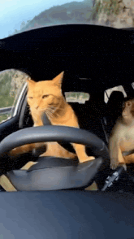

# Car Clicker

A small Cookie Clicker Steam mod made by **Moxolote**. It automates cookie clicking and can also catch golden cookies and wrath cookies while you play or keep the game in the background.

## Features

- Adjustable click speed up to 1000 CPS
- Big cookie autoclicking
- Golden cookie detection and clicking
- Optional wrath cookie clicking
- Start/stop controls and `Alt+E` shortcut
- Minimize the control panel so it does not cover the game
- Settings saved automatically

## Installation

Copy this folder into Cookie Clicker's local mods folder:

`Cookie Clicker/resources/app/mods/local/`

Then enable **Car Clicker** from the game's Mods menu.

## Controls

- `Alt+E`: start or stop the autoclicker
- `F7`: stop the autoclicker

Use it for fun, and remember that automation can disable Steam achievements in Cookie Clicker.

Made by **Moxolote**.
